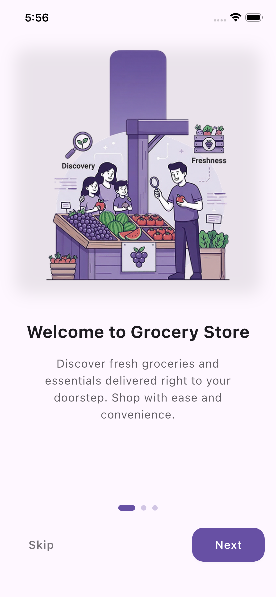

# GrocerX - Flutter Grocery UI Template (Lite Version)

  
  

Welcome to the **GrocerX Lite** repository! This is a clean, modern, and highly responsive Flutter UI template designed for grocery delivery and e-commerce apps. 

I built this to help developers skip the wireframing and tedious UI debugging. It features a custom-illustrated onboarding flow and a flawless codebase (0 warnings, perfect `flutter analyze` score).

## 🚀 Get the PRO Version (Complete App Template)
Loved the clean UI and want the fully functional template? The **Pro Version** saves you dozens of hours of development time by including full state management, cart logic, and backend-ready models.

| Feature | GrocerX Lite (Free) | GrocerX PRO (Premium) |
| :--- | :---: | :---: |
| Clean UI & Flawless Code | ✅ | ✅ |
| Custom Onboarding Screens | ✅ | ✅ |
| Home Screen Layout | ✅ | ✅ |
| **Shopping Cart Logic & State** | ❌ | ✅ |
| **Checkout & Payment Flow UI** | ❌ | ✅ |
| **Auth Screens (Login/Signup)** | ❌ | ✅ |
| **User Profile & Order History** | ❌ | ✅ |
| **Premium Support** | ❌ | ✅ |

🔥 **[Click Here to Get GrocerX PRO on Gumroad]** 🔥

## 🛠 Getting Started with Lite
1. Clone the repository: `git clone https://github.com/yourusername/GrocerX-Lite.git`
2. Run `flutter pub get`
3. Run the app on your preferred emulator or device.

## 📄 License
This Lite version is open-sourced under the MIT License. You are free to use it for personal projects. For commercial use and full features, please upgrade to the Pro version.
