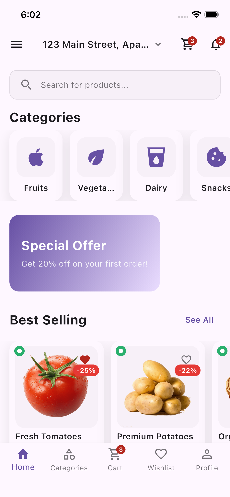
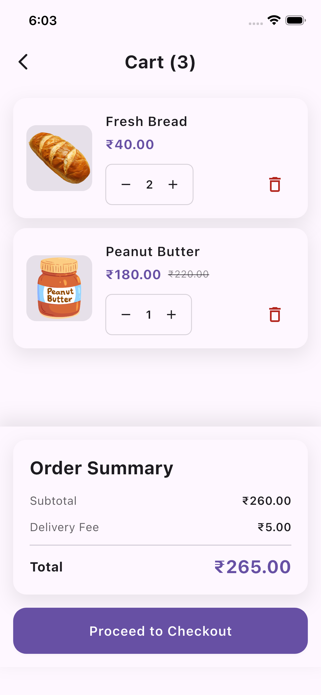
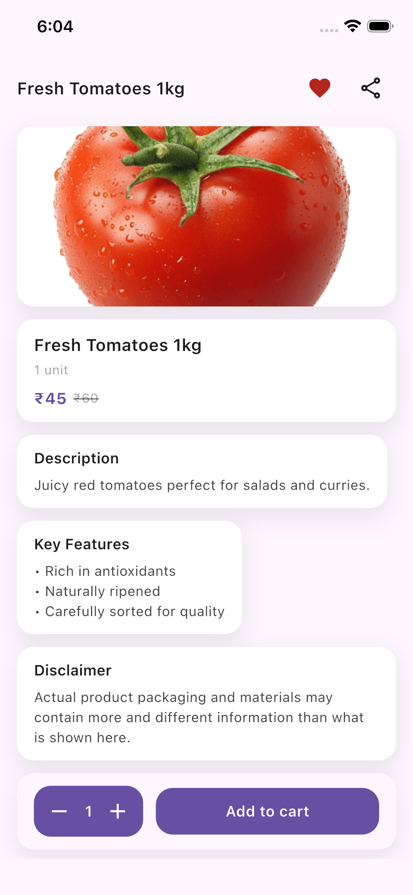

# GrocerX Lite 🛒

A pixel-perfect, modern Grocery E-commerce UI kit built with Flutter. This "Lite" version provides a high-quality frontend foundation for your next shopping application, showcasing clean UI and professional folder structure.

---

## 🚀 Upgrade to GrocerX Premium (Full Source Code)

Love the UI? Save **40+ hours** of development time by upgrading to the **Premium Version**. While this Lite version provides the static UI, the Premium version includes the complete, functional architecture you need to launch a real-world app.

### 💎 Why Upgrade to Premium?
* **Fully Reactive State:** Complete business logic built with **GetX** for Cart, Checkout, and Auth flows.
* **Clean Architecture:** Production-ready layered structure (Domain, Data, & Presentation).
* **0 Analyzer Issues:** 100% Null Safe, 0 Lint Errors, 0 Warnings—pure professional code.
* **Functional Logic:** Dynamic cart calculations, Category filtering, and Auth routing.

🔥 **[GET THE PREMIUM SOURCE CODE ON GUMROAD](https://naveendhalan.gumroad.com/l/GrocerX)**

---

## ✨ Features Comparison

| Feature | GrocerX Lite (Free) | GrocerX Premium ($29) |
| :--- | :---: | :---: |
| 20+ Premium Screens | ✅ | ✅ |
| Custom App Logo & Icons | ✅ | ✅ |
| Pixel-Perfect UI | ✅ | ✅ |
| **GetX State Management** | ❌ | ✅ |
| **Functional Shopping Cart** | ❌ | ✅ |
| **Complete Checkout Flow** | ❌ | ✅ |
| **Auth Logic (Login/OTP/Signup)** | ❌ | ✅ |
| **Clean Architecture Setup** | ❌ | ✅ |

---

## 📸 Preview

  
  
  

---

## 🛠 Tech Stack
* **Framework:** Flutter (Latest Stable)
* **State Management:** GetX (Premium Only)
* **Architecture:** Clean Architecture (Premium Only)
* **Linting:** Flutter Lints (Zero Warnings)

---

## 📄 Usage
The **Lite version** is intended for educational purposes and UI exploration. 

By purchasing the **[Premium Version](https://naveendhalan.gumroad.com/l/GrocerX)**, you gain full access to the source code, including all business logic and architecture, which you can use to build and launch your own commercial applications or client projects.

---
Built with ❤️ by [Naveen Dhalan](https://github.com/Naveendhalan)
